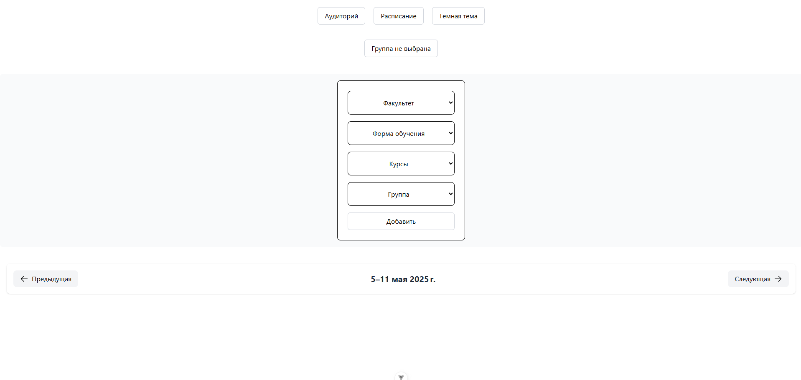
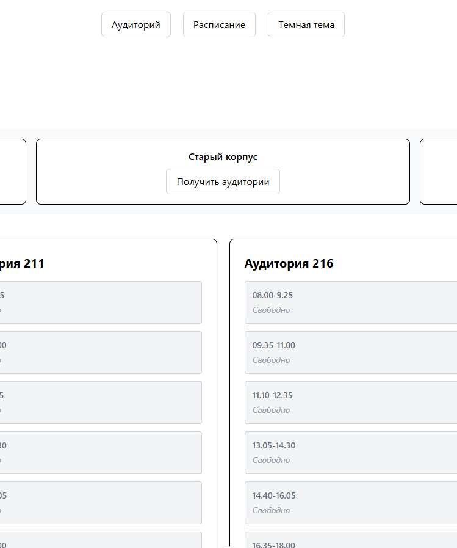
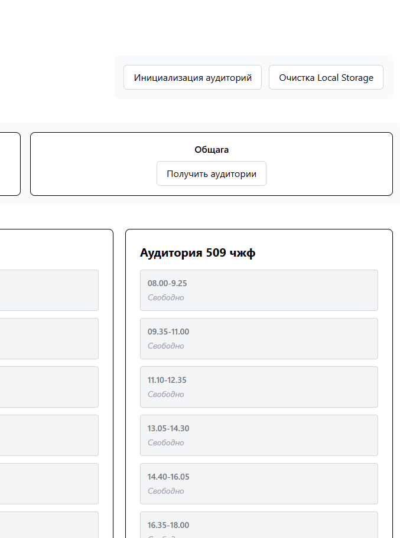
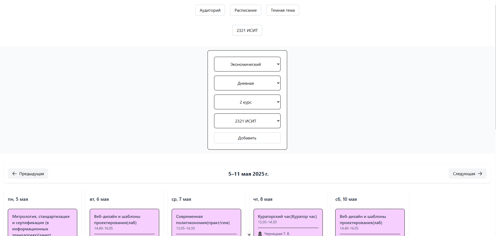

# Free Auditorium MITSO

This is my first serious project. The essence of the project is that it would be possible to check the occupancy of the audience at the MITSO University, and I also added the ability to view the schedule of your group.


## Installation

##### 1. Clone Repository

```bash
git clone https://github.com/Nadoedatel/MITSO-Free-Classrooms-TS.git
```

##### 2. NPM
```bash
npm install
```
```bash
npm run dev
```

## Screenshots

<table>
  <tr>
    <td width="50%">
      <h3>Auditorium</h3>
      
    </td>
    <td width="50%">
      <h3>Schedule</h3>
      
    </td>
  </tr>
</table>

## Features

<table>
  <tr>
    <td width="50%">
      <h3>Auditorium</h3>
      
    </td>
    <td width="50%">
      <h3>Schedule</h3>
      
    </td>
  </tr>
   <tr>
    <td width="50%">
      <h3>Auditorium</h3>
      
    </td>
    <td width="50%">
      <h3>Schedule</h3>
      
    </td>
  </tr>
</table>
